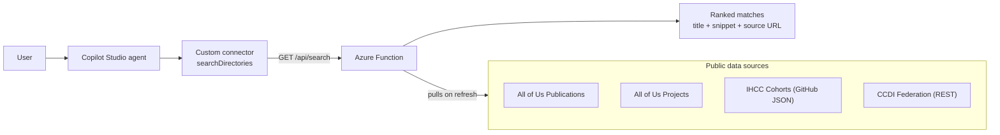
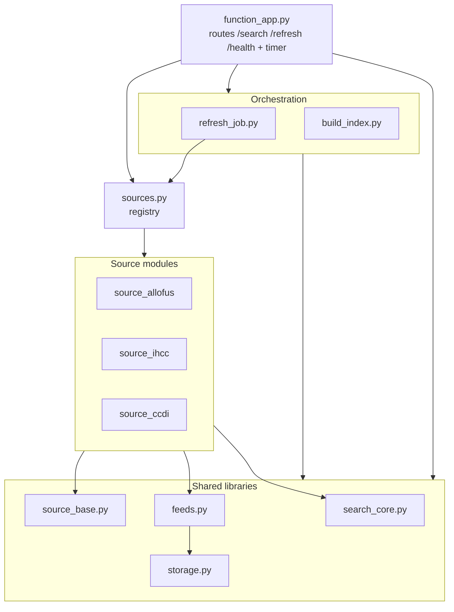
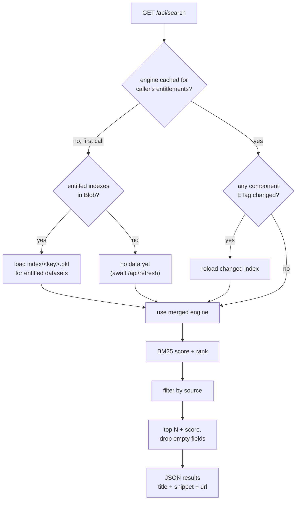
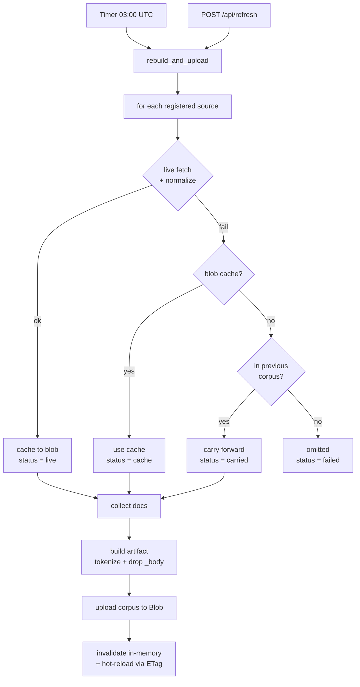
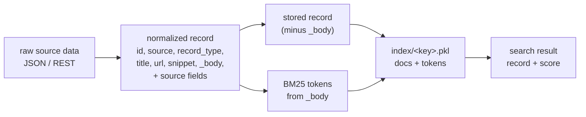

# Architecture — All of Us Research Finder

A Copilot Studio agent that finds similar research and datasets across four public
sources (All of Us publications & projects, IHCC cohorts, CCDI datasets) and
returns ranked matches with clickable source links. The backend is an Azure
Functions (Python v2) app that keeps a BM25 search index over a normalized,
refreshable corpus.

> **PNG exports** of every diagram (for non-GitHub viewers) are in
> [`docs/diagrams/`](diagrams/); the `.mmd` sources there can be re-rendered with
> `mmdc -i <file>.mmd -o <file>.png -b white -s 2`.

---

## 1. End-to-end context

*Left-to-right request pipeline; the data sources hang off the Function on a
single ingest edge so nothing crosses the request path.*

---

## 2. Module map (dependencies)

Layered top-to-bottom: entry point → orchestration → registry → source modules →
shared libraries. Each source module (`source_allofus`, `source_ihcc`,
`source_ccdi`) uses the same shared libraries, so those are drawn as one edge from
the group instead of nine crossing edges.

---

## 3. Search request flow (three-layer cache)

Layers: **(1)** in-memory per-entitlement merged engine per worker, **(2)** per-dataset
Blob indexes (`index/<key>.pkl`, refreshable without redeploy; ETags re-checked every
`CORPUS_CHECK_SECONDS`). Deployed packages ship no indexes — Blob is populated by the
first `/api/refresh` or the daily timer (a local `index/<key>.pkl` is a dev-only
fallback). `_body` is never returned.

---

## 4. Refresh flow (per-source resilience)

**Resilience guarantee:** a single source being down (IHCC atlas in maintenance,
a CCDI node timing out) never blanks the corpus — it falls back to its last cache,
then to carry-forward from the previous snapshot.

---

## 5. Record lifecycle (data shape)

Every record shares the required keys `id, source, record_type, title, url,
snippet, _body`; `_body` is the searchable blob (tokenized then dropped). Source
modules add their own fields (authors, countries, diseases, organization, ...).
