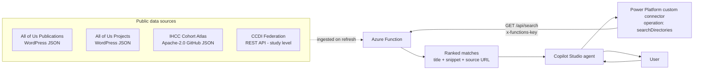
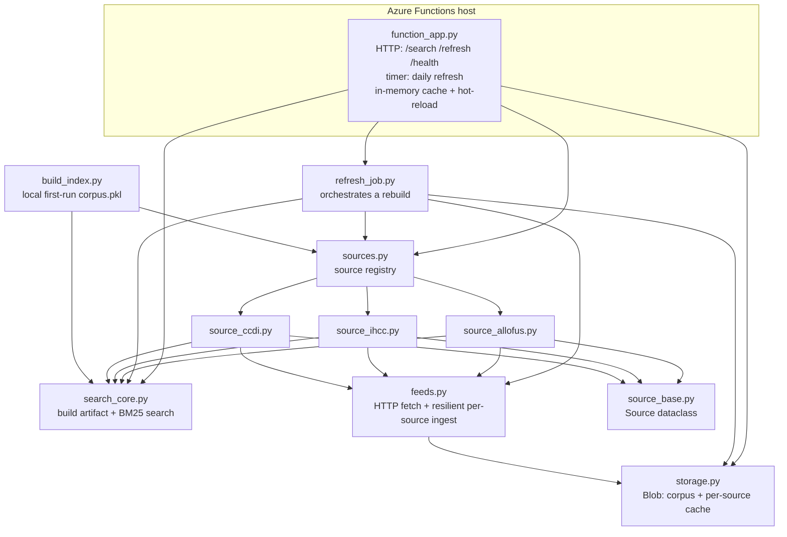
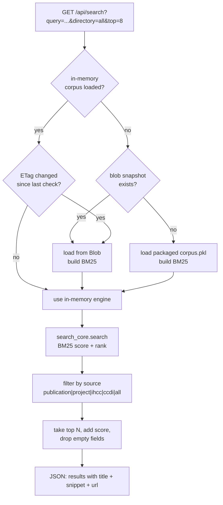
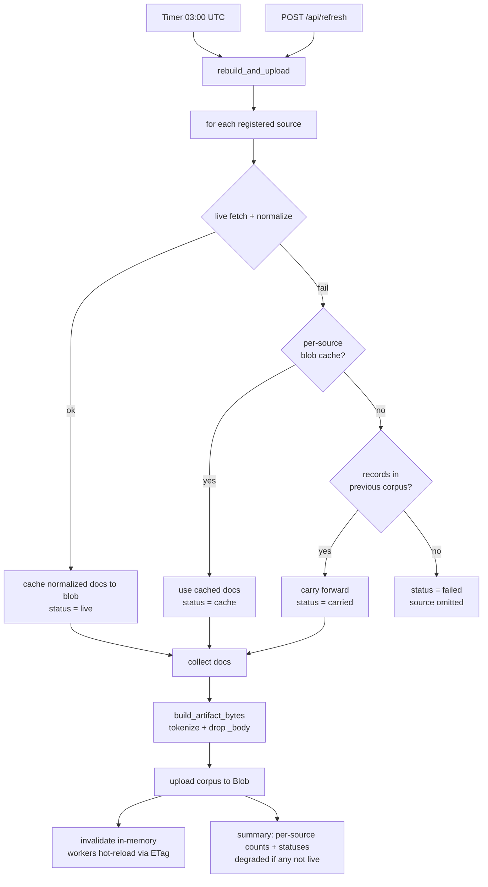
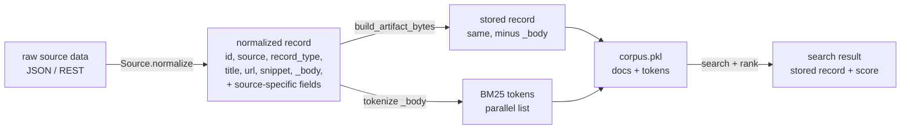

# Architecture — All of Us Research Finder

A Copilot Studio agent that finds similar research and datasets across four public
sources (All of Us publications & projects, IHCC cohorts, CCDI datasets) and
returns ranked matches with clickable source links. The backend is an Azure
Functions (Python v2) app that keeps a BM25 search index over a normalized,
refreshable corpus.

---

## 1. End-to-end context

---

## 2. Module map (what depends on what)

**Roles**
- **function_app.py** — the only Functions entry point: 3 HTTP routes + 1 timer; owns the in-memory engine and hot-reload.
- **sources.py / source_base.py** — the registry and the `Source` abstraction (`key`, `label`, `fetch()`, `normalize()`). Adding a source = new `source_*.py` + one registry line.
- **source_allofus / source_ihcc / source_ccdi** — per-source fetch + normalize into the common record schema.
- **feeds.py** — HTTP `fetch()` and `load_source_resilient()` (cache to blob, fall back to cache).
- **search_core.py** — source-agnostic: builds the artifact (tokenize + drop `_body`) and runs BM25 search/filter.
- **storage.py** — Blob helpers for the corpus snapshot and per-source caches (managed identity or connection string).
- **refresh_job.py** — iterates the registry and assembles a new corpus with per-source resilience.
- **build_index.py** — builds the packaged `corpus.pkl` first-run fallback.

---

## 3. Search request flow (three-layer cache)

Layers: **(1)** in-memory per worker (fast path), **(2)** Blob snapshot (refreshable
without redeploy; workers re-check the ETag every `CORPUS_CHECK_SECONDS`), **(3)**
packaged `corpus.pkl` (first-run fallback). `_body` is never returned.

---

## 4. Refresh flow (timer + on-demand, per-source resilience)

**Resilience guarantee:** a single source being down (e.g. the IHCC atlas in
maintenance, or a CCDI node timing out) never blanks the corpus — it falls back to
its last cache, then to carry-forward from the previous snapshot.

---

## 5. Record lifecycle (data shape)

Every record shares the required keys `id, source, record_type, title, url,
snippet, _body`; `_body` is the searchable blob (tokenized then dropped). Source
modules add their own fields (authors, countries, diseases, organization, ...).
