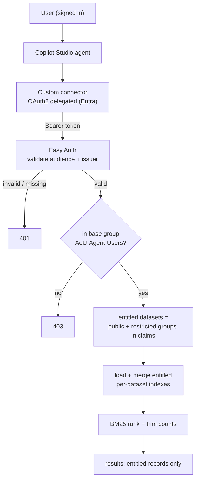

# Authentication & Authorization Design

**Status: Implemented** (branch `feature/multi-source`). This is the design of record
for authentication and authorization; the as-built details and operator setup are
in [`security-hardening.md`](security-hardening.md).

## 1. Requirement
Access to datasets is entitlement-based and per user:
- **Public** datasets: available to any authenticated user with the base entitlement.
- **Restricted** datasets: each is an **independent compartment**. In this solution
  the **IHCC** and **CCDI** datasets are restricted: a user granted the **IHCC**
  entitlement must **not** see **CCDI** data, and vice‑versa. Users may hold any
  combination (additional restricted datasets follow the same pattern).

This is per-user, need-to-know authorization, so the **end user's identity must
flow to the service** — an app-only service principal cannot satisfy it.

**Access is layered — "public" is not open to the internet.** Every request
requires authentication *and* membership in the base entitlement group
(`AoU-Agent-Users`); that base group is what gates "public" datasets. Restricted
datasets require an *additional* per-dataset group on top of the base entitlement.
So an unauthenticated caller gets `401`, an authenticated caller without the base
group gets `403`, and "public" means "available to all entitled agent users," not
"available to the general public."

## 2. Decisions (confirmed)
| Decision | Choice |
|---|---|
| Identity | **Delegated Entra ID (OAuth 2.0 authorization-code)** on the connector |
| Dataset entitlement | **One Entra security group per restricted dataset** (public datasets need no *dedicated* group — they are gated by the base entitlement below) |
| Tiers | Binary per dataset: `public` or `restricted` (restricted = compartmented by dataset) |
| Base entitlement | An Entra **group** (`AoU-Agent-Users`) required to use `/search` |
| Refresh (HTTP) | Requires the **`Agent.Admin`** app role |
| Health | **Anonymous**; enumerates every dataset (incl. restricted) with name + record count, from a manifest |
| Index strategy | **Per-dataset indexes**; load/merge only entitled ones |
| Group claims | **Filtered group claims** (groups assigned to the app) to keep tokens lean and avoid the >200-group overage |
| Classification source of truth | Maintained **in the application dataset config** |

## 3. Recommended mechanism (summary)
Delegated Entra OAuth2 for identity → **Easy Auth** validates the JWT on the
Function → the Function reads the caller's **group claims** → computes entitled
datasets (public + restricted groups the user holds) → loads **only those
per-dataset indexes** → BM25 ranks → returns results (and counts) **trimmed** to
the entitled set. `Agent.Admin` app role gates HTTP refresh.

## 4. Entra objects (customer GCC tenant)
- **API app registration** ("AllOfUs-Function-API")
  - Expose an API → scope `access_as_user`; Application ID URI `api://<api-app-id>`.
  - App Role: **`Agent.Admin`** (member type: Users/Groups).
  - Token configuration: emit **group claims filtered to groups assigned to the app**.
- **Client app registration** ("AllOfUs-Function-Client") — delegated; pre-authorized
  to the API's `access_as_user` scope (connector uses this).
- **Groups**
  - `AoU-Agent-Users` — base entitlement (public datasets + agent use).
  - `AoU-DS-<name>` — one per **restricted** dataset (currently `AoU-DS-IHCC` and
    `AoU-DS-CCDI`).
- Admin consent for the API scope; assign `Agent.Admin` to admins.

## 5. Authorization rules (enforced in the Function, after Easy Auth)
| Endpoint | Rule |
|---|---|
| `GET/POST /api/search` | Require `AoU-Agent-Users`; entitled datasets = all `public` + every `restricted` whose group is in the caller's claims. Trim results **and counts** to that set. `403` if base group absent. |
| `POST /api/refresh` | Require **`Agent.Admin`** app role; rebuilds all dataset indexes. `403` otherwise. |
| `GET /api/health` | Anonymous; enumerates **every** dataset (incl. restricted) with `name` + record `count` read from `index/manifest.json`. Discloses restricted dataset names + counts (not content) — an accepted trade-off for operational visibility. |

Note: the internal **daily timer** refresh runs in-process (no HTTP token) and is
unaffected by the `Agent.Admin` gate — that gate protects only the HTTP endpoint.

## 6. Data classification config (source of truth)
Maintained in the app; each dataset declares its classification and (if restricted)
its entitlement group and index blob:

```jsonc
{
  "publication": { "classification": "public",     "index_blob": "index/publication.pkl" },
  "project":     { "classification": "public",     "index_blob": "index/project.pkl" },
  "ihcc":        { "classification": "restricted", "entitlement_group_id": "<AoU-DS-IHCC guid>",
                   "index_blob": "index/ihcc.pkl" },
  "ccdi":        { "classification": "restricted", "entitlement_group_id": "<AoU-DS-CCDI guid>",
                   "index_blob": "index/ccdi.pkl" }
}
```
Current classification: **publication** and **project** are public (gated by the base
entitlement); **ihcc** and **ccdi** are restricted, each requiring its own group
(`AoU-DS-IHCC`, `AoU-DS-CCDI`).
The `Source` in the registry carries `classification`, `entitlement_group_id`, and
its index blob name — but these are **applied from an app-settings JSON map**
(`DATASET_CLASSIFICATION`), not hardcoded in the source modules. Changing a dataset's
classification or its entitlement group is therefore an **app-settings change (which
restarts the app)** plus the matching Entra group work — **not an application redeploy**.

## 7. Index architecture (extends today's registry)
- Refresh builds **each dataset's index independently** → uploads `index/<dataset>.pkl`
  (natural extension of the current per-source normalization from one merged corpus).
- The Function keeps a **per-index in-memory cache** (dict keyed by dataset) with
  ETag hot-reload; a restricted index is loaded lazily the first time an entitled
  user requests it.
- All blobs remain in the MI + private-endpoint-protected storage account. Restricted
  content is **never loaded** for an unentitled caller, so a trimming bug cannot leak it.

## 8. Authorized request flow



## 9. Where it lives in the code
| Area | Implementation |
|---|---|
| `code/function_app.py` | claims parse + base-group check on `/search`, `Agent.Admin` on `/refresh`, per-request entitled-index selection; routes are `ANONYMOUS` (Easy Auth gates) |
| `code/auth.py` | parse `X-MS-CLIENT-PRINCIPAL`; `has_base`, `is_admin`, `entitled_keys` |
| `code/source_base.py`, `sources.py` | `classification`, `entitlement_group_id`, `index_blob`; applied from `DATASET_CLASSIFICATION` |
| `code/refresh_job.py`, `storage.py` | per-dataset index blobs + manifest |
| `code/search_core.py` | merged engine over the entitled index set |
| `custom_connector/openapi-swagger.yaml` | OAuth 2.0 (Entra, delegated) connector |
| `deployment/deploy_azure_infrastructure.ps1` | greenfield: infra + app registrations, groups, Easy Auth, `Agent.Admin` role, Key Vault, GCC authorities |
| `tests/` | authorization + trimming tests (entitled vs unentitled; admin vs non-admin refresh; anonymous health) |

## 10. Service principal — where it lands
Not for user access (no user context). Retained only for **non-interactive machine
callers** (e.g., an external scheduler triggering refresh) holding `Agent.Admin`.

## 11. GCC considerations
Use gov-cloud authorities (`login.microsoftonline.us`, `*.azurewebsites.us`), create
the app registrations/groups in the **customer GCC tenant**, and parameterize the
IaC/connector accordingly.

## 12. Rollout & local dev
The greenfield deployment provisions the Entra objects, Easy Auth, and app settings
and enforces authorization from day one (`AUTH_ENFORCED=true`). The flag exists so the
code can also run without Easy Auth for **local development** (`local.settings.json`
sets it `false`). See [`security-hardening.md`](security-hardening.md) for the operator
setup steps.
